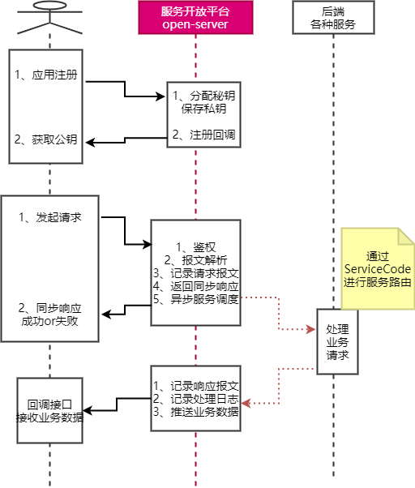

#1 项目介绍
图灵服务开放平台DDD优化版。模拟微信开放平台，淘宝开放平台等平台设计的一个针对图灵商城实现的服务开放平台。
需求就是能够通过服务开放平台，将图灵商城后端的各种微服务，以一种安全统一的方式对互联网的其他第三方应用开放。

#2 项目重点  
DDD优化版体现的价值在于设计，而不在于具体的实现(鼓励装逼，非常鼓励你对示例中看不惯的地方进行优化)。  
但是请注意，这个示例的重点，不是具体的业务实现，而是需要考虑在服务开放平台open-server中，日后需要引入
更多更复杂的鉴权机制，需要接入更多更多的后端服务，要思考从这个简单的服务开放平台往互联网上那些大型服务开放平台演进
的过程中，如何保持整个应用的稳定性。

#3 如何看示例项目：
项目重点为了演示DDD设计思想，以及如何使用DDD从单体架构演进成为微服务架构。  
- 数据层：  
  MVC版的设计路线是优先设计表结构，通过UML图、时序图等工具，优先设计出能够支撑业务的表结构。
然后再从Controller开始实现接口，Service实现业务。这样的设计，如果业务需要变更，比如项目中，对于
  第三方系统的ClientInfo表设计，如果后续鉴权系统需要优化，对客户端的表述就需要改变。这样就需要改ClientInfo表结构，
  随之而来就会要改动上层业务，会相当被动。  
  而使用DDD后，优先设计的是实体，与表结构之间可以有仓库来进行隔离。以后修改ClientInfo实体，不会直接影响到数据。
  对于ClientInfo表结构的改动也只会影响仓库层，而不会直接影响实体以及更上层的业务。  
  在当前项目中，ClientInfo表要设计出reserve1和reserve2表就是体现了这种思想。
  MVC设计下，只能不断冗余，浪费性能，也不够灵活。而在DDD设计下，对这些冗余字段的处理就非常灵活，可以随时变动。
- 服务层：   
  确定表结构后，MVC的通常设计方式会通过很多Service来表现业务，这些Service的数据边界是混乱的，不清晰的。这就会造成后续梳理业务非常困难、  
  而采用DDD后，业务的边界都体现在实体中，从实体就可以很快的梳理出业务。以后要做微服务架构的变动，就比较容易。
  体现出的思想就是业务层面只要专注于组织业务逻辑，而不需要有任何的实现，包括各种组件的获取、组装都不需要管。  
  在当前项目中，开放平台中包含的三个领域就是体现这种思想。每个领域都通过应用层进行隔离，这些领域，不管在单体架构下，还是在微服务架构下，
  都能表现出同样的业务能力。  
- 整体架构：  
  MVC的整体架构是按技术层面来切分，与需求设计是脱节的。通常能够看到的是Controller、Service等这些技术层面的package，而业务究竟如何并不清晰。  
  DDD的整体架构则是以领域来切分，与需求设计是一致的。需求设计需要有哪些功能模块，在DDD中就能看到有哪些Package。这些Package就是体现出来的一个个领域能力。
  这些领域能力的逻辑边界是清晰的，称为BC。按照DDD的理论体系对BC进行保护，就可以将整个应用灵活的在单体架构和微服务架构之间进行转换。  
- 实现重点：  
  - 整体来说，优先实现单体架构的快速验证。    
  单体架构下，各个后端服务都以SPI扩展的形式插入到open-server当中，以后接入新的服务，只需要服务端按规则提供对应的jar包就可以了，Server端不需要做任何变动。client发过来的请求，通过ServiceCode就能找到对应的处理类。
  可以接入mobilearea和mobiletag两个服务。
  - 接下来演示从单体架构快速升级为微服务架构。  
  微服务架构下，各个后端服务都以服务的形式注册到Nacos中，这里设计了一种所有服务采用相同的Group，而服务名就是负责的serviceCode。
  这样，client发过来的请求，在server端，可以通过ServiceCode去Nacos的不同Group下请求同样的服务实现。这样以后接入新的服务时，后端服务只要按这个规则注册对应的微服务就可以了，同样也不需要做任何变动。  
  实现的过程只影响genservice这个领域。将service/impl/local包下的组件替换成/Nacos包即可。  
  这里将替换成Nacos后的相关组件全部放到一个包里，对DDD的整体结构是有破坏的，毕竟不可能同时支持单体架构和微服务架构。
  
#3、最后强调  
DDD是一种开放的设计思想，不是一个严谨的技术点。所以，鼓励各抒己见，但禁止互相吐槽。
